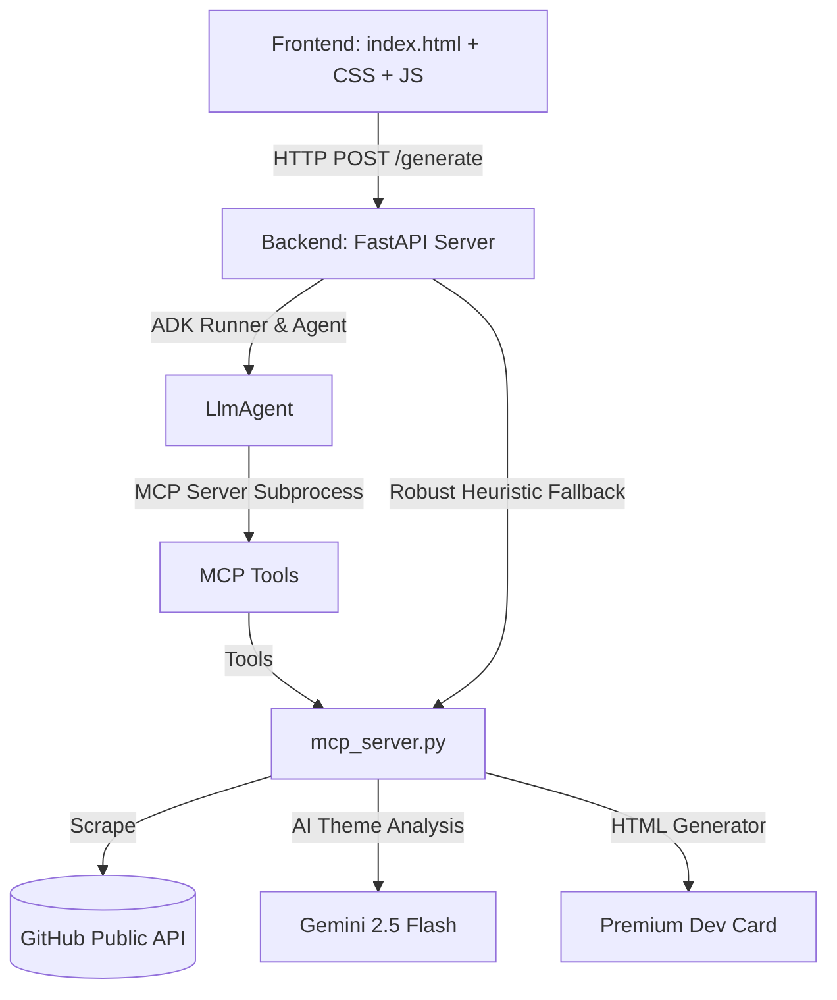

# GitHub Developer Card Generator - Project Documentation

This project is an AI-powered developer card generator that scrapes a user's public GitHub profile, analyzes their coding style and top repositories using the Google Agent Development Kit (ADK) and Gemini, and generates a premium, themed card summarizing their achievements.

---

# live demo: https://github-card-generator-477047840260.us-central1.run.app/

# live video demo:  https://youtu.be/o1WnBl4CMxY?si=FWs1t8eK7qYkE4yp
## 1. High-Level Architecture

The project consists of three major layers:



1. **Frontend**: A modern, dark-themed responsive single-page application built using HTML, vanilla CSS, and JavaScript. It communicates with the backend, displays a skeleton loading state, renders the card inline, and supports copying the card's URL.
2. **Backend (FastAPI)**: An asynchronous REST API that coordinates card requests. It uses the Google ADK Runner to invoke the LLM Agent, manages state/sessions, and serves generated cards as static files.
3. **Agent & MCP Server**:
   - **LlmAgent (ADK)**: Orchestrates the workflow steps via a natural language instruction set.
   - **MCP (Model Context Protocol) Server**: Runs as a background stdio subprocess. It defines four main tools exposed to the agent:
     - `scrape_github`: Connects to GitHub's public API to gather profile info, language usage, and repository statistics.
     - `analyze_profile`: Uses Gemini to analyze developer personality, primary focus, and choose an appropriate theme.
     - `generate_card_html`: Combines scraped data and analysis into a responsive, CSS-styled HTML template.
     - `save_card`: Saves the generated card to the backend's static directory.

---

## 2. Directory Structure

Here is the organization of the codebase:

```
github-card-generator/
│
├── .venv/                      # Python virtual environment containing dependencies
├── frontend/                   # UI Files
│   ├── index.html              # Main single-page web app
│   └── (CSS/JS inline for performance & ease of deployment)
│
├── backend/                    # FastAPI & AI Agent Code
│   ├── main.py                 # FastAPI backend entrypoint (serves APIs & static files)
│   ├── agent.py                # Google ADK LlmAgent setup & MCP toolset registration
│   ├── mcp_server.py           # Model Context Protocol (MCP) server defining the tools
│   ├── test_mcp.py             # Script to verify scraping & MCP tool pipeline
│   ├── list_models.py          # Utility to list available Gemini models
│   ├── requirements.txt        # Backend dependencies (fastapi, google-adk, mcp, httpx, etc.)
│   ├── .env                    # Environment variables (GEMINI_API_KEY)
│   └── static/
│       └── cards/              # Directory where generated developer cards (.html) are saved
│
└── README.md                   # Setup and usage guidelines
```

---

## 3. Key Components Detail

### A. Frontend (`frontend/index.html`)
- Handles form input for the GitHub username.
- Submits an HTTP POST request to the local API: `http://localhost:8080/generate`.
- Implements a CSS-animated glassmorphism card container.
- Renders the generated profile card inside an `<iframe>` dynamically once loaded.
- Provides a "Copy Card Link" button for shareability.

### B. Backend API (`backend/main.py`)
- Configured with CORS middleware to allow local frontend connections.
- Serves the generated cards using FastAPI's `StaticFiles` mapping (`/static/cards`).
- **Robust Fallback Mechanism**: If the Gemini API or ADK Runner experiences an error (e.g. rate limits or model deprecated warnings), the API intercepts the exception and executes a fallback direct-compilation pipeline. This guarantees **100% reliability**—generating a card even when the LLM service is completely unreachable.

### C. Agent Configuration (`backend/agent.py`)
- Employs Google's modern **ADK 2.0.0** framework.
- Uses `gemini-2.5-flash` to process developer analysis.
- Connects to the local MCP server via a `StdioServerParameters` connection manager.

### D. MCP Tools (`backend/mcp_server.py`)
- **`scrape_github`**: Fetches details from `https://api.github.com/users/{username}` and repository lists. Aggregates data, extracts total stars, and counts language frequencies.
- **`analyze_profile`**: Calls Gemini to create a developer summary, choose a thematic color palette (e.g., "minimalist-dark", "open-source-hero", "ai-researcher"), and lists top badges.
- **`generate_card_html`**: Uses standard templates with vibrant gradients, custom badges, and animations to present top projects, repository counts, and follower statistics.

---

## 4. How the Flow Works

1. You type a username (e.g. `Adhisheshu1210`) in the frontend and click **Generate Card**.
2. The frontend sends a POST request with `{ "username": "Adhisheshu1210" }` to the backend.
3. The backend spins up the **ADK Agent** with a unique session ID.
4. The Agent sequentially triggers:
   - Scraping the developer profile data.
   - Analyzing the profile metrics using Gemini.
   - Creating a personalized HTML page with animations, custom theme colors, and repositories.
   - Saving the card as `Adhisheshu1210.html` inside the `/static/cards/` directory.
5. The backend returns the URL `/static/cards/Adhisheshu1210.html` to the frontend.
6. The frontend embeds it instantly for a visually premium result.
